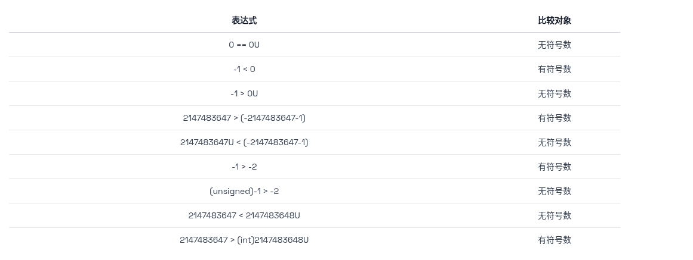

# 信息的表示和处理
## basis
|hex|decimal|binary|hex|decimal|binary|
|:-----|:------|:---------|:-----|:------|:---------|
|0  |0  |0000   |8	|8	|1000|
|1	|1	|0001	|9	|9	|1001|
|2	|2	|0010	|A	|10	|1010|
|3	|3	|0011	|B	|11	|1011|
|4	|4	|0100	|C	|12	|1100|
|5	|5	|0101	|D	|13	|1101|
|6	|6	|0110	|E	|14	|1110|
|7	|7	|0111	|F	|15	|1111|
## memory representation

## basic opertaion
|And|Or|Xor|logic not|Complement|Negate|
|:-----:|:---:|:---------:|:-----:|:------:|:---------:|
|&|\||^|!|-|~|
## tow's completement
unsigned：$$B2U(X) = \sum_{i = 0 } ^ {w - 1} {2^{i}* x_i}$$
signed：$$B2U(X) = -x_{w-1}*2^{w - 1} +\sum_{i = 0 } ^ {w - 2} {2^{i}* x_i}$$
* $Umin = 0$
* $Umax = 2^{w} -1$
* $Tmin = -2^{w - 1}$
* $Tmax = 2^{w - 1} −1$
### shift notation

### comparsion

### overflow
overflow is undefined behavior , nothing is guaranteed to be happened

## IEEE floating point

$ v=(−1)^{s}*M*2^E $

