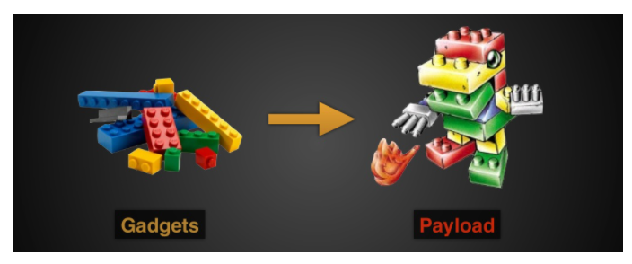
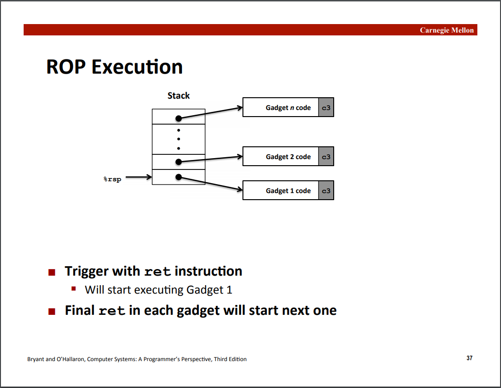
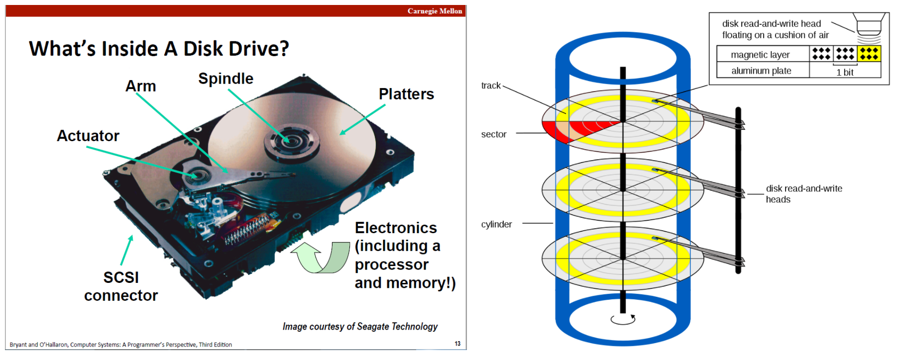
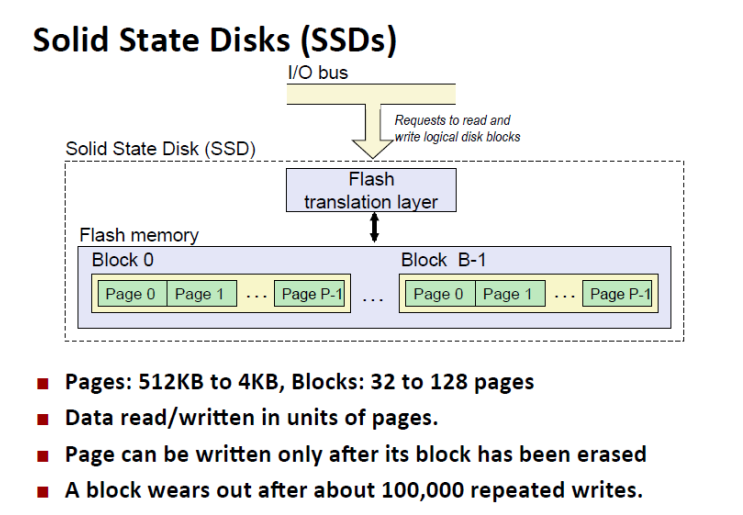
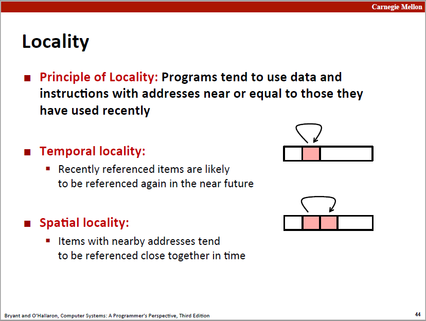
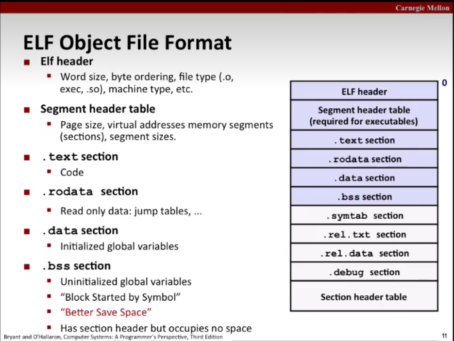
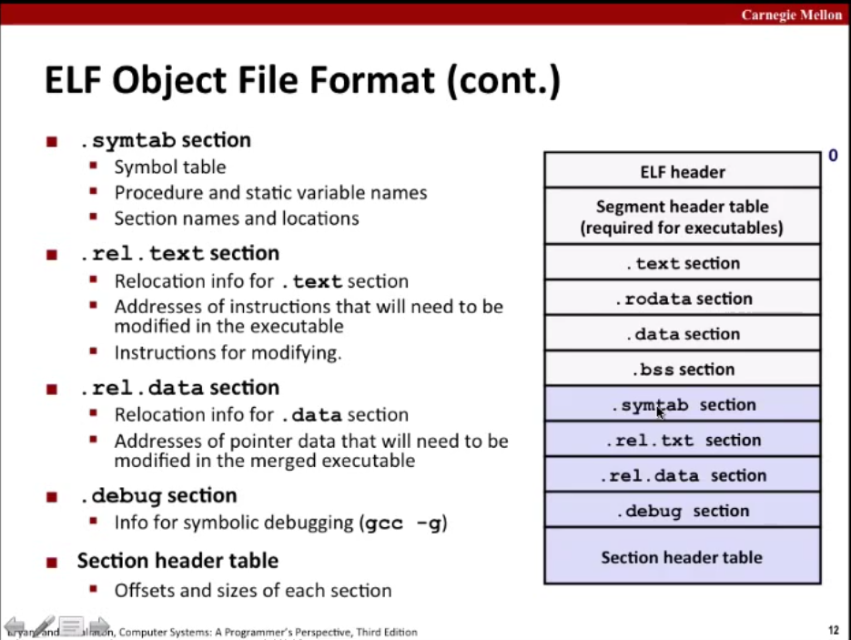
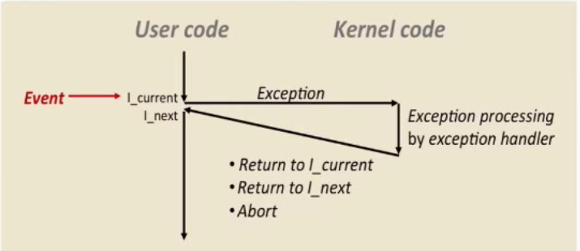

# Representing and Manipulating Information
## basis
|hex|decimal|binary|hex|decimal|binary|
|:-----|:------|:---------|:-----|:------|:---------|
|0  |0  |0000   |8	|8	|1000|
|1	|1	|0001	|9	|9	|1001|
|2	|2	|0010	|A	|10	|1010|
|3	|3	|0011	|B	|11	|1011|
|4	|4	|0100	|C	|12	|1100|
|5	|5	|0101	|D	|13	|1101|
|6	|6	|0110	|E	|14	|1110|
|7	|7	|0111	|F	|15	|1111|
## memory representation

## basic opertaion
|And|Or|Xor|logic not|Complement|Negate|
|:-----:|:---:|:---------:|:-----:|:------:|:---------:|
|&|\||^|!|-|~|
## tow's completement
unsigned：$$B2U(X) = \sum_{i = 0 } ^ {w - 1} {2^{i}* x_i}$$
signed：$$B2U(X) = -x_{w-1}*2^{w - 1} +\sum_{i = 0 } ^ {w - 2} {2^{i}* x_i}$$
* $Umin = 0$
* $Umax = 2^{w} -1$
* $Tmin = -2^{w - 1}$
* $Tmax = 2^{w - 1} −1$
### shift notation

### comparsion

### overflow
overflow is undefined behavior , nothing is guaranteed to be happened

## IEEE floating point

$ v=(−1)^{s}*M*2^E $


### rounding
* towards zero
* round up
* round down
* nearest even(default)
# Machine-Level Representation of Programs
complex instruction set computer(CISC)<br>
reduced instruction set computer(RISC)
<figure>
  
  <figcaption  style="text-align: center; margin-top: 8px;">main instruction set</figcaption>
</figure>


<figure>
  
  <figcaption  style="text-align: center; margin-top: 8px;">from c code to binary</figcaption>
</figure>

<figure>
  
  <figcaption  style="text-align: center; margin-top: 8px;">register(partial)</figcaption>
</figure>

## memory layout
<figure>
  
</figure>

### stack frame
<figure>
  
</figure>

* memory align
### attack
#### Code Injection

#### Return-Oriented Programming


#### tools
* gdb
* objdump
# Program Optimization
## optimization
* Code motion/precomputation
* Strength reduction
* Sharing of common subexperssions
* Removing unnecessary procedure calls
* Exploiting instruction-level parallelism
* Dealing with conditionals(branch prediciton)
* Loop unrolling
  * Reassociated Computation
  * Separate Accumulators
* Vector instructions
## optimization blockers
* procedure calls<br>
    complier treats procedure calls as black box, weak optimization 
    
    
* ### memory alising
    ```c
    int fn (int *a, int *b)
    {
        *a = 3;
        *b = 4;
        return (*a + 5);
    }

    // 编译器会把以上代码优化成下面的样子么？不会！谁知道程序员会不会这么调用 f(&x,&x);
    int fn (int *a, int *b)
    {
        *a = 3;
        *b = 4;
        return (3 + 5);
    }

    // 但是你可以帮助编译器，使用C99的restrict类型限定符，但还是需要开发者确保两个指针不指向同一数据
    // https://gcc.gnu.org/onlinedocs/gcc/Restricted-Pointers.html
    int fn (int *__restrict__ a, int *__restrict__ b)
    {
        *a = 3;
        *b = 4;
        return (*a + 5); // 这里会被优化为 return (3 + 5)
    }
    ```
# Memory hierarchy
## RAM(random access memory)
* SRAM
* DRAM
## I/O bus
## disk

## SSD

## Locality

## Memory hierarchy

## Cache memory
C = B * E * S<br>
validate bit<br>
tag bit

cache miss
* cold(compulsory) miss
* conflict miss
* capacity miss

thrash<br>
miss rate
hit rate 
hit time 
miss penalty
## example

Blocking : $1 / (4B) * n^3$<br>
No Blocking : $9 / (8) * n^3$
# Linking
two main tasks
* symbol resolution
* relocation
### ELF format


### Local variable
* local non-static C variable
  * store on stack(linker know nothing about it)
* local C variable
  * stored in either .bss or .data
### symbols and rules
strong symbols
* precedures and initialized globals
weak symbols
* uninitialized globals
three rules(be careful for tricky bug)
* not more than one strong symbol with same name
* one strong symbol and one weak symbol has the same name , choose the strong one
* more than one weak symbols all has the same name , random choose one

relocate entry<br>
static library(.a)<br>
* command line order matters!
* Moral: put the libraries at the end of the commmand line.
shared library(.so)
### Library interpositioning
intercept calls to arbitrary function
* Complie time(#define)
* Link time(-Wl)
* run-time(library interpositioning, lysm, LD_PRELOADED environment variable)
# Exceptional Control Flow
An exception is a transfer of control to the OS kernal in response to some event<br>

Exception
* Asynchronous Exceptions 
  * interrupt
    * time interrupt 
    * I/O interrrupt
* Synchronous Exceptions
  * trap
    * intentional
    * system calls, breakpoint traps
  * fault
    * unintentional and possibly recoverable
    * page faults, protection faults
  * abort
    * unintentional and unrecoverable
    * illegal instruction

`syscall`<br>

A `process` is an instance of a running program
* Logical Control Flow
* private address space<br>

mode bit<br>
> concurrent flow, concurrency<br>
> mutiltasking, time slice, time slicing<br>
> parallel flow, running in pararllel and parallel execution

## Context switch

A context is being in one of three states
* running
* stopped
* terminated
### Process control
PID(process id, positive number)<br>
```c
pid_t getpid(void); //return pid
pid_t getppid(void);//return parent pid
``` 

```c
int fork(void);
// return 0 to the child process, return child's pid to parent process
```


```c
pid_t waitpid(pid_t pid, int *statusp, int options);
pid_t wait(int *statusp);

unsigned int sleep(unsigned int secs);
int pause(void);

int execve(const char *filename, const char *argv[], const char *envp[]);

pid_t getpgrp(void);
int setpgid(pid_t pid, pid_t pgid);

int kill(pid_t pid, int sig);
```
### Signal